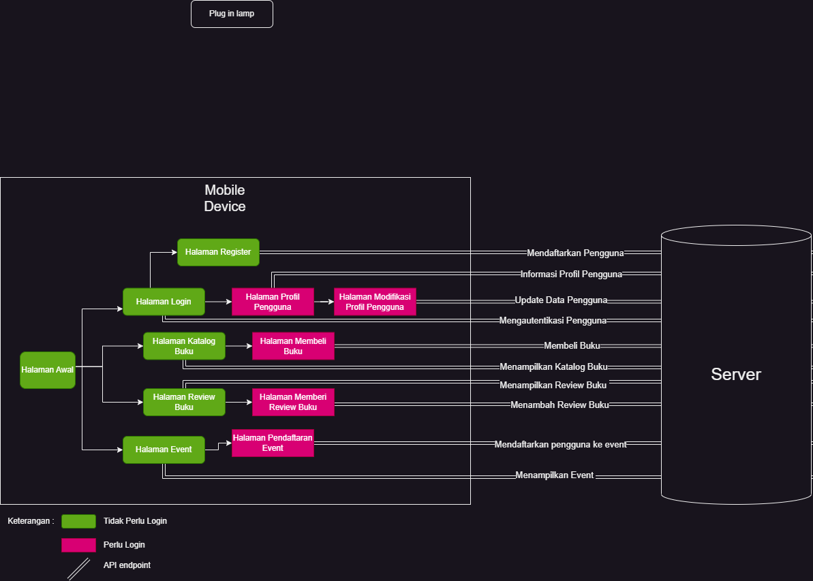

# booka_mobile

A new Flutter project.

## Daftar Nama Anggota Kelompok
- Muh. Syarief Mulyadi
- Fathan  Naufal Adhitama
- Neina Akada Maula
- Rayhan Dwi Sakha

## What is Booka
Di era digital yang terus berkembang, memperkenalkan Booka, aplikasi inovatif yang mendukung kecintaan Anda terhadap literatur. Booka hadir sebagai sahabat setia Anda untuk menjelajahi dunia literasi dengan cara yang tak terlupakan.

   - Bayangkan Anda memiliki perpustakaan pribadi yang tak terbatas, tetapi berada di ujung jari Anda. Dengan **Book Catalogue**, Anda dapat menjelajahi ribuan buku dari berbagai genre dan penulis. 

   - Booka tak hanya tentang halaman buku, tetapi juga tentang acara dan kegiatan yang berkaitan dengan dunia literasi. Ikuti acara penulis kesukaan Anda, bergabung dengan kelompok diskusi buku yang seru, dan daftarkan diri Anda pada acara-acara menarik lainnya dengan fitur **Book Event**.

   - Terkadang, memilih buku bacaan dapat menjadi sebuah tantangan. Itu sebabnya, **Book Review** hadir untuk membantu Anda dengan menghadirkan ulasan dan rekomendasi dari pembaca lain. Bagikan pandangan Anda atau temukan pandangan yang cocok dengan selera Anda. Dalam Booka, dunia buku akan terasa lebih dekat dan terhubung.

   - Di dalam Booka, Anda bukan sekadar seorang pembaca, melainkan pribadi yang menciptakan cerita literasi sendiri. Dengan **Reading Profile**, Anda dapat membangun profil pribadi Anda. Catat buku-buku yang telah Anda baca dan buat daftar buku yang ingin Anda tambahkan ke wishlist. 

Dengan Booka, kami ingin mengubah pengalaman membaca Anda menjadi lebih dari sekadar aktivitas membaca, melainkan pengalaman yang mendalam, berarti, dan terhubung. Selamat datang di Booka, di mana dunia literasi berada di genggaman Anda.

## Module Aplikasi
1. Book Catalogue :

   Must Have Feature:
      - Pembelian buku
      - Browsing katalog buku

   Good to Have Feature:
      - Admin dapat memodifikasi katalog buku
   
2. Book Event :

   Must Have Feature:
      - Browsing event buku
      - Pendaftaran diri ke event

   Good to Have Feature: 
      - Admin dapat memodifikasi katalog event
   
3. Book Review :   

   Must Have Feature:
      - Thread Comment review buku serta rating buku menggunakan bintang
      - Daftar 10 buku dengan review tertinggi

   Good to Have Feature: 
      - Admin dapat melakukan moderasi thread comment
   
4. Reading Profile :

   Must Have Feature:
      - Menampilkan profile user yang terdiri dari nama, foto profil, daftar teman, dan bio singkat
      - Browsing Profile user lain untuk ditambahkan ke friendlist

   Good to Have Feature: 
      - Wishlist buku
      - Reading progress

## Peran Pengguna 

1. User Biasa:

   - Membeli buku baik cetak dan digital di aplikasi book catalogue
   - Melakukan browsing event yang tersedia di aplikasi book event serta dapat mendaftarkan dirinya ke event tersebut
   - Memberikan ulasan kepada buku baik dalam bentuk rating maupun komentar
   - Melakukan kostumisasi profil yang menampilkan informasi mengenai pengguna

2. Admin:
   - Menambahkan, menghapus, mengubah kapasitas buku cetak yang ditampilkan di aplikasi book katalog
   - Menambahkan event baru dan menghapus event yang telah berlalu
   - Moderasi thread comment ulasan, serta menghapus ulasan yang dinilai melanggar community guidelines
   - Melakukan kostumisasi profil yang menampilkan informasi mengenai pengguna

## Alur Integrasi

Flowchart
 
-masing bikin paragraf yang menjelaskan fungsi dari server django yang bakal kalian pake

Link Berita Acara:
https://docs.google.com/spreadsheets/d/1zSDaLfim8v-SQiW4og5bOMEO0BqFKL72i5rJ9kFA0jw/edit?usp=sharing